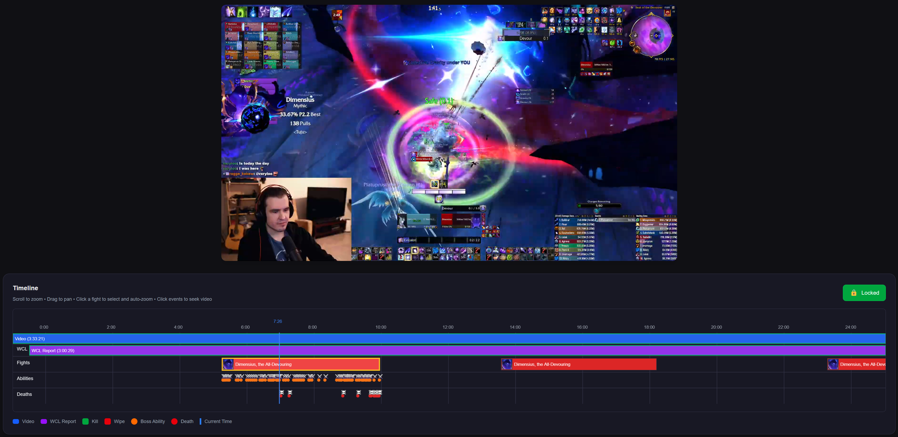

# WCL VOD Review

A web application that synchronizes Warcraft Logs combat reports with video recordings, making it easier to review and analyze World of Warcraft raid encounters.



## What It Does

Ever tried to figure out what went wrong during a boss fight by cross-referencing a Warcraft Logs report with a Twitch VOD or YouTube video? **WCL VOD Review** solves that problem by syncing the two together.

Simply provide:

- A Warcraft Logs report URL
- A YouTube or Twitch VOD link

The app creates an interactive timeline where you can see exactly what was happening in the combat log at any moment in the video. Click on deaths or boss abilities in the timeline, and the video instantly jumps to that moment.

## Key Features

### 📊 Interactive Timeline

- Visual representation of all boss fights in a raid session
- Combat events displayed as markers (player deaths, boss abilities)
- Current video position indicator
- Zoom and pan to explore different time ranges
- Boss icons pulled directly from the game

### 🎯 Click-to-Seek

Click any event on the timeline to jump directly to that moment in the video. Perfect for:

- Reviewing wipes and understanding what went wrong
- Analyzing specific boss mechanics
- Checking player positioning during key moments
- Learning from successful pulls

### 🔄 Smart Synchronization

- Automatic timeline sync based on timestamps
- Manual adjustment controls for fine-tuning
- Lock/unlock toggle to prevent accidental changes

### 📹 Dual Platform Support

Works with both:

- YouTube videos
- Twitch VODs

## Use Cases

**Raid Leaders**: Quickly review pulls to identify issues and plan strategy improvements

**Players**: Watch your own gameplay synced with combat data to improve performance

**Guild Officers**: Create detailed post-raid reviews with specific timestamps

**Theorycrafters**: Analyze boss mechanics and player responses frame-by-frame

## Technology

Built with modern web technologies:

- **Frontend**: Next.js 15 with React 19 and TypeScript
- **Backend**: Express API with TypeScript
- **Database**: MongoDB for caching API responses
- **Deployment**: Docker Compose for easy setup

Integrates with:

- Warcraft Logs API
- Battle.net API (for boss icons)
- YouTube Data API
- Twitch Helix API

## Getting Started

### Prerequisites

- Docker and Docker Compose
- API credentials for:
  - Warcraft Logs (OAuth client)
  - Battle.net (OAuth client)
  - YouTube (API key)
  - Twitch (OAuth client)

### Running the Application

1. Clone the repository:

```bash
git clone https://github.com/yourusername/wcl-vod-review.git
cd wcl-vod-review
```

2. Create a `.env` file with your API credentials:

```env
WCL_CLIENT_ID=your_wcl_client_id
WCL_CLIENT_SECRET=your_wcl_client_secret
BLIZZARD_CLIENT_ID=your_blizzard_client_id
BLIZZARD_CLIENT_SECRET=your_blizzard_client_secret
YT_API_KEY=your_youtube_api_key
TWITCH_CLIENT_ID=your_twitch_client_id
TWITCH_CLIENT_SECRET=your_twitch_client_secret
MONGODB_URI=mongodb://mongodb:27017/wcl-vod-review
```

3. Start the application:

```bash
docker-compose up
```

4. Open your browser to `http://localhost:3000`

## How to Use

1. Navigate to the homepage
2. Paste a Warcraft Logs report URL (e.g., `https://www.warcraftlogs.com/reports/AbCdEfGh`)
3. Paste a YouTube or Twitch VOD URL
4. Click "Go to Timeline"
5. Select a fight from the timeline
6. Click on events to jump to specific moments in the video
7. Use scroll to zoom, drag to pan the timeline
8. Unlock the sync controls to manually adjust if needed

## Project Structure

```
wcl-vod-review/
├── backend/          # Express API server
│   └── src/
│       ├── index.ts          # Main server file
│       ├── lib/              # API integrations (WCL, YouTube, Twitch, etc.)
│       ├── models/           # MongoDB schemas
│       └── types/            # TypeScript types
├── frontend/         # Next.js application
│   └── src/
│       ├── app/              # Pages and routes
│       ├── components/       # React components (timeline, video players)
│       └── lib/              # Frontend utilities
└── docker-compose.yml
```

## Contributing

Contributions are welcome! Feel free to open issues or submit pull requests.

## License

This project is licensed under the MIT License - see the [LICENSE](LICENSE) file for details.

## Acknowledgments

- Thanks to Warcraft Logs for providing comprehensive combat logging
- Blizzard Entertainment for World of Warcraft
- The WoW raiding community for inspiration
  Combine WCL logs and VODs for reviewing
