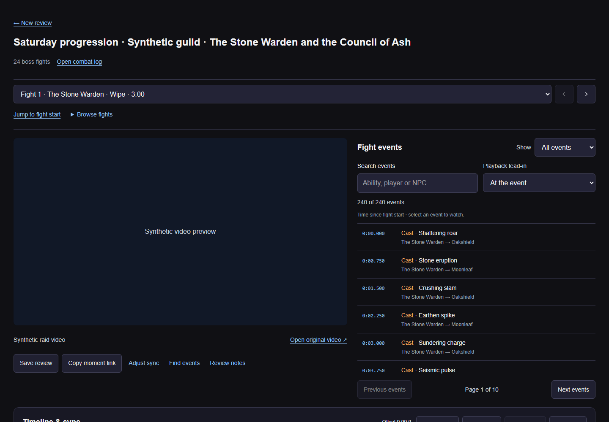

# WCL VOD Review

A web application that synchronizes Warcraft Logs combat reports with video recordings, making it easier to review and analyze World of Warcraft raid encounters.



## What It Does

Ever tried to figure out what went wrong during a boss fight by cross-referencing a Warcraft Logs report with a Twitch VOD or YouTube video? **WCL VOD Review** solves that problem by syncing the two together.

Simply provide:

- A Warcraft Logs report URL
- A YouTube or Twitch VOD link

The app creates an interactive timeline where you can see exactly what was happening in the combat log at any moment in the video. Click on deaths or boss abilities in the timeline, and the video instantly jumps to that moment.

## Key Features

### 📊 Interactive Timeline

- Visual representation of all boss fights in a raid session
- One timeline row per NPC ability, with Warcraft Logs spell icons
- One compact death row with named, class-colored markers
- Current video position indicator
- Zoom and pan to explore different time ranges
- Boss icons pulled directly from the game

### 🎯 Click-to-Seek

Click any event on the timeline to jump directly to that moment in the video. Perfect for:

- Reviewing wipes and understanding what went wrong
- Analyzing specific boss mechanics
- Checking player positioning during key moments
- Learning from successful pulls

### Find the Right Pull and Moment

- Browse the raid by boss and result, or step through fights with Previous/Next
- Search events by ability, player or NPC; the event list and timeline show the same matches
- Inspect precise fight-relative timestamps and choose to watch 3, 5 or 10 seconds before an event
- Keep the selected fight, filters and event page through refresh and browser Back/Forward
- Copy a moment link with the current event filters and playback lead-in

The recording and a bounded event list sit together on desktop. On mobile, evidence comes before notes; seeking brings the recording into view, and "Find events" returns to the event list. Unknown fight results are labeled explicitly, and death counts represent occurrences, including repeated deaths after a resurrection.

### 🔄 Smart Synchronization

- Twitch timestamp estimate with an explicit alignment check
- Manual fight-start alignment for either video platform (YouTube publication time is not recording time)
- Twitch stream-delay compensation plus 0.5-second fine-tuning controls
- Per-report/VOD calibration saved in the browser
- Lock/unlock toggle to prevent accidental changes

### 📹 Dual Platform Support

Works with both:

- YouTube videos
- Twitch VODs

### Saved Reviews and Raid Notes

- Save the selected fight, video position and calibration, then reopen the review from the start page
- Copy a moment link that opens with the same fight and synchronization in another browser
- Capture a note at the current video time; the timestamp stays fixed while you write
- Revisit, edit or delete notes, with undo for removals
- Export a Markdown debrief with links to each captured moment

Reviews and notes are stored only in this browser, for this site's address. There is no account or cloud backup. Export important notes before clearing browser data or changing devices. Moment links contain report/video identifiers and calibration, but no note text; recipients still need access to the original report and recording. The library holds up to 20 reviews, with 100 notes of up to 2,000 characters each. Existing reviews are never automatically evicted.

## Use Cases

**Raid Leaders**: Quickly review pulls to identify issues and plan strategy improvements

**Players**: Watch your own gameplay synced with combat data to improve performance

**Guild Officers**: Create detailed post-raid reviews with specific timestamps

**Theorycrafters**: Analyze boss mechanics and player responses frame-by-frame

## Technology

Built with modern web technologies:

- **Frontend**: Next.js 16 with React 19 and TypeScript
- **Backend**: Express API with TypeScript
- **Database**: MongoDB for caching API responses
- **Deployment**: Docker Compose for easy setup

Integrates with:

- Warcraft Logs API
- Battle.net API (for boss icons)
- YouTube Data API
- Twitch Helix API

## Getting Started

### Prerequisites

- Docker and Docker Compose
- Warcraft Logs OAuth credentials
- YouTube Data API credentials and/or Twitch Helix credentials for the VOD platforms you use
- Optional Battle.net API credentials for boss icons

### Running the Application

1. Clone the repository:

```bash
git clone https://github.com/Koodattu/wcl-vod-review.git
cd wcl-vod-review
```

2. Create the backend environment file and fill in the credentials you use:

```bash
cp backend/.env.example backend/.env
```

```env
WCL_CLIENT_ID=your_wcl_client_id
WCL_CLIENT_SECRET=your_wcl_client_secret
YT_API_KEY=your_youtube_api_key
TWITCH_CLIENT_ID=your_twitch_client_id
TWITCH_CLIENT_SECRET=your_twitch_client_secret
BLIZZARD_CLIENT_ID=your_blizzard_client_id
BLIZZARD_CLIENT_SECRET=your_blizzard_client_secret
```

3. Start the application:

```bash
docker compose up --build
```

4. Open your browser to `http://localhost:3000`

Only the frontend port is published; MongoDB and the backend stay on the private Compose network. For an internet deployment, put the frontend behind HTTPS. Twitch requires HTTPS for embeds on non-localhost domains.

### Production deployment

The live application is [wcl.koodattu.dev](https://wcl.koodattu.dev). The existing `koodattu-auto-deploy.timer` on `vaarattu-server` checks `main` about every five minutes, fast-forwards the checkout, and builds/recreates the application with Docker Compose. A normal push to `main` is a production release.

The authoritative operating instructions and configuration are in the sibling `deployments` repository, starting with its `README.md`. On the server, the app lives at `/srv/projects/wcl-vod-review` and uses `docker-compose.yml` together with `/srv/projects/deployments/overrides/wcl-vod-review.yaml`. The shared Caddy proxy provides HTTPS; the backend and MongoDB remain private.

Use the existing `ssh vaarattu-server` access to verify a release. The successful app/deployments revision pair is recorded in `/var/lib/koodattu-auto-deploy/wcl-vod-review.state`; project-specific results appear in the `koodattu-auto-deploy.service` journal. Check the three application containers' health and the public page after deployment. The shared service can report a failure for another project even when this application deployed successfully. Let the running deployer finish before considering a manual release, and follow the deployments repository's rollback guidance.

## How to Use

1. Navigate to the homepage
2. Paste a Warcraft Logs report URL (e.g., `https://www.warcraftlogs.com/reports/AbCdEfGh`)
3. Paste a YouTube or Twitch VOD URL
4. Click "Create timeline"; fight IDs and video timestamps from your links are preserved
5. Select a fight from the dropdown or timeline; "Browse fights" filters the raid by boss and result
6. Pause the video at that fight's start and click "Align fight start to current video time"
7. Search for an ability/player/NPC, choose a playback lead-in if useful, then select a cast or death in the event list or canvas to seek the video
8. Use Earlier/Later for fine calibration, or unlock the bars to drag them. Fit, zoom and pan buttons are available alongside mouse controls
9. Use "Save review" to keep your place, or "Copy moment link" to hand off the synchronized moment
10. Open "Review notes" and choose "Add note at current time" to record an observation, then "Export notes" for a debrief you can keep or share

Event search, type, page and lead-in are restored from the URL. Boss/result filters apply to the browse list; Previous/Next always steps through the full report. A lead-in never changes the displayed event timestamp and cannot make an event outside the recording valid. Saved reviews retain their existing fight/position/calibration format; copied moment links also include the event view. Notes remain private to browser storage.

Unavailable reports, events, video details and players have separate retry controls. Calibration is saved per report/video in this browser; if storage is blocked, it still works for the current session. A shared link or saved note restores its captured calibration without overwriting your browser's calibration until you adjust the sync. Storage failures retain the note draft and show an error; a blocked clipboard reveals a selectable link instead.

## Local verification with synthetic data

Use Node.js 20.9 or newer, the locked npm dependencies, and Docker. These tests never load `backend/.env`. The integration and browser fixture runners accept only an explicit localhost database named `wcl_goal_test_*`; use a dedicated disposable container because test databases are written and dropped.

From the repository root in PowerShell:

```powershell
npm.cmd --prefix backend ci
npm.cmd --prefix frontend ci
Push-Location frontend
npx.cmd --no-install playwright install chromium
Pop-Location
docker run --name wcl-review-tests --detach --publish 127.0.0.1:57117:27017 --memory 512m --cpus 1 mongo:7.0.40@sha256:be3d6353f3ea3fd3d22e016d19da20fcd6937eda0739eb6d2aeed335baa60f90
$env:MONGODB_TEST_URI='mongodb://127.0.0.1:57117/wcl_goal_test_review'
npm.cmd --prefix backend test
npm.cmd --prefix backend run test:integration
npm.cmd --prefix frontend run test:e2e
npm.cmd --prefix frontend run lint
npm.cmd --prefix frontend run build
$env:WCL_TEST_PRODUCTION='1'
npm.cmd --prefix frontend run test:e2e
Remove-Item Env:WCL_TEST_PRODUCTION
docker rm --force --volumes wcl-review-tests
```

Check that the container name and ports 57117, 43180 and 43181 are free first. Do not remove an existing container with that name. Remove only the test container you created, after test servers have stopped. The browser suite starts a synthetic Express API on 43181 and Next on 43180, with real MongoDB and external provider/SDK doubles. It checks a fixture marker before the full-stack journey. Without `MONGODB_TEST_URI`, the browser suite runs UI scenarios and skips the two full-stack cases. On sandboxed Windows, process-tree cleanup may require the normal out-of-sandbox approval mechanism; it works in a normal local shell.

For interactive UI review with the synthetic player, keep the same test URI and run `npm.cmd --prefix frontend run test:e2e -- --debug --project=desktop test/full-stack.spec.ts`. Step through the journey in Playwright's inspector. The scenario uses report `https://www.warcraftlogs.com/reports/SyntheticReport1#fight=1` and video `https://youtu.be/localVideo1?t=40`; these are test IDs, and the player is a local SDK double. Close the test session before removing the disposable container.

See [the improvement work log](work/goal-improvement/STATE.md) for verification evidence, cache compatibility and deferred security findings. Live provider playback and real-device behavior need separate verification with authorized credentials.

## Project Structure

```
wcl-vod-review/
├── backend/          # Express API server
│   └── src/
│       ├── index.ts          # Main server file
│       ├── lib/              # API integrations (WCL, YouTube, Twitch, etc.)
│       ├── models/           # MongoDB schemas
│       └── types/            # TypeScript types
├── frontend/         # Next.js application
│   └── src/
│       ├── app/              # Pages and routes
│       ├── components/       # React components (timeline, video players)
│       └── lib/              # Frontend utilities
└── docker-compose.yml
```

## Contributing

Contributions are welcome! Feel free to open issues or submit pull requests.

## License

This project is licensed under the MIT License - see the [LICENSE](LICENSE) file for details.

## Acknowledgments

- Thanks to Warcraft Logs for providing comprehensive combat logging
- Blizzard Entertainment for World of Warcraft
- The WoW raiding community for inspiration
  Combine WCL logs and VODs for reviewing
